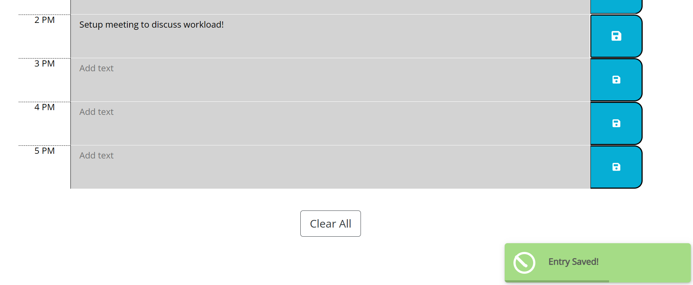

# Daily Planner App
A simple calendar application taht allows a user to save events for each hour of the day.


## Preview
[Live Preview Daily Planner App](https://dodzikojo.github.io/Daily-Planner-App/ "Live Preview")

## Project Requirements
* Display the current day at the top of the calender when a user opens the planner.
* Present timeblocks for standard business hours when the user scrolls down.
* Color-code each timeblock based on past, present, and future when the timeblock is viewed.
* Allow a user to enter an event when they click a timeblock
* Persist events between refreshes of a page


## Functionality
* All hourly time blocks are injected into the HTML using jQuery
    ```html
    <div class="container" id="time-blocks">
    <!-- Timeblocks go here (injected using jQuery)-->

    </div>
    ```
* The HTML injection is done using a function as below:
    ```javascript
    function createTimeBlock(hourBlockId, textAreaClass) {
        .....
        hourTextEl.appendTo(newTimeBlockDivEl);
        textAreaEl.appendTo(newTimeBlockDivEl);
        icon.appendTo(saveBtnEl)
        saveBtnEl.appendTo(newTimeBlockDivEl);
        newTimeBlockDivEl.appendTo('#time-blocks');
        .....
    }
    ```

* A "success toast" is displayed when the user saves an entry.
    

* In addition, the user can choose to clear all entries using the "Clear All" button. A confirmation modal shows to confirm this action.

## UI Preview
